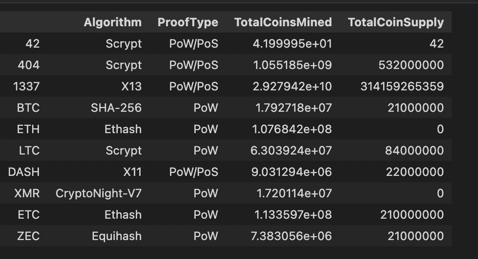
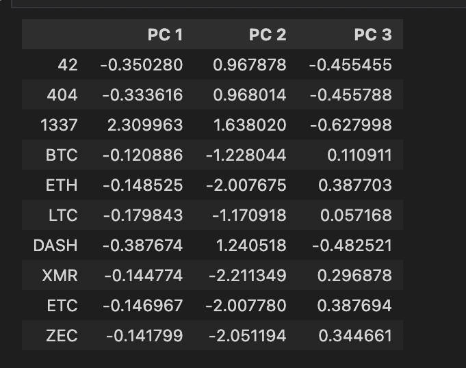
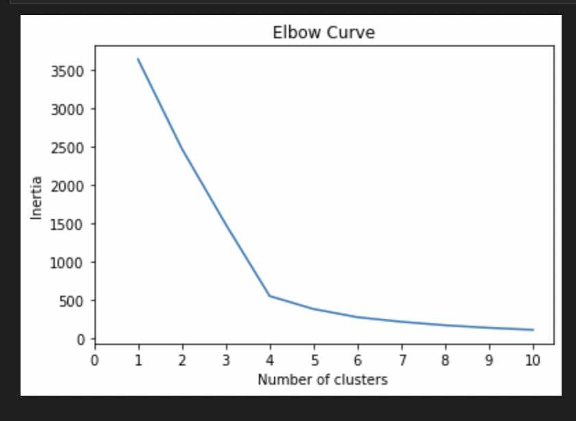
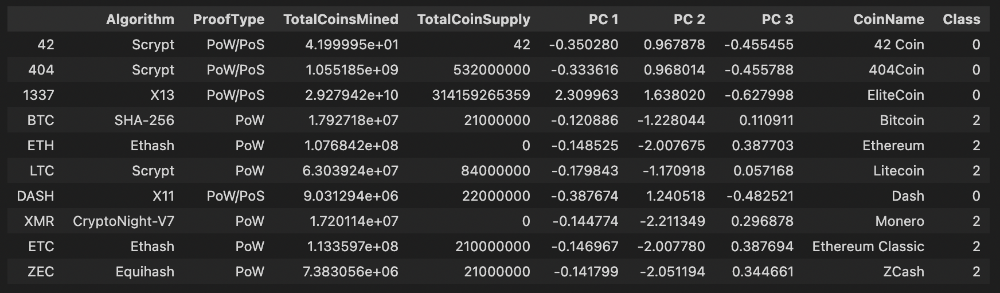
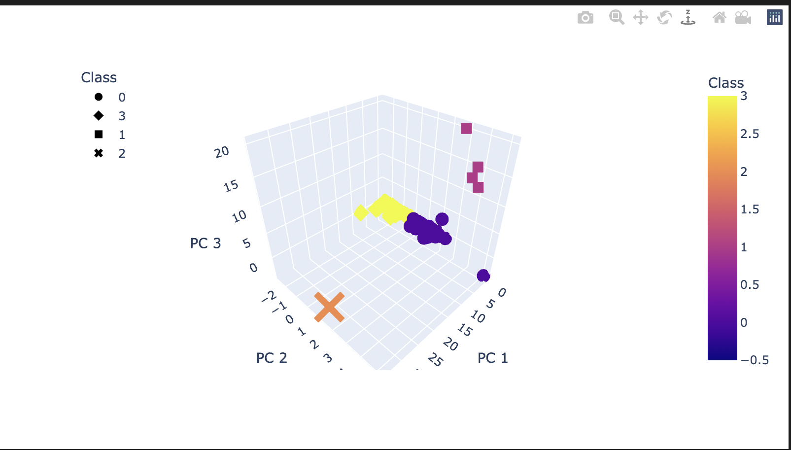
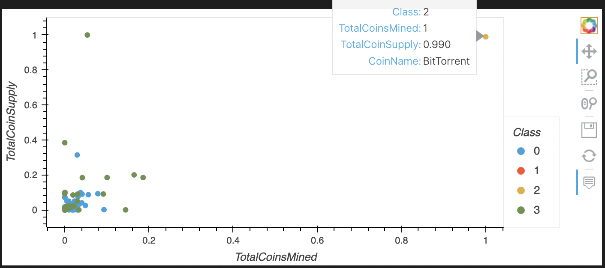

# Cryptocurrencies

## Overview

Unsupervised learning, also known as unsupervised machine learning, uses machine learning algorithms to analyze and cluster unlabeled datasets. These algorithms discover hidden patterns or data groupings without the need for human intervention. Its ability to discover similarities and differences in information make it the ideal solution for exploratory data analysis, cross-selling strategies, customer segmentation, and image recognition.

This project uses cryptocurrencies data and try to categorize them to build a classification system for new investors. The potential investors are probably lost in cryptocurrency so they will be presented with a report on what cryptocurrencies are on the market and how to categorize them.

The main purpose of this project are;
- Preprocessing the Data for PCA
- Reducing Data Dimensions Using PCA
- Clustering Cryptocurrencies Using K-means
- Visualizing Cryptocurrencies Results

## Results

### Preprocessing data for PCA

The imported dataframe after pre-processing with Pandas:

### Reducing data dimensions using PCA

Dataframe with three principal components after dimension reduction using PCA:

### Clustering Cryptocurrencies Using K-means

Best value of K using Elbow curve:

Clustered dataframe using predicted clusters and crpytocurrencies features:

### Visualizing Cryptocurrencies Results

A cluster in a scatter plot is a group of points that follow the same general pattern. They could follow a linear pattern or a curved pattern. Clusters can contain many points.

3D-Scatter with the PCA data and the clusters:

The total number of tradable cryptocurrencies is 532:

